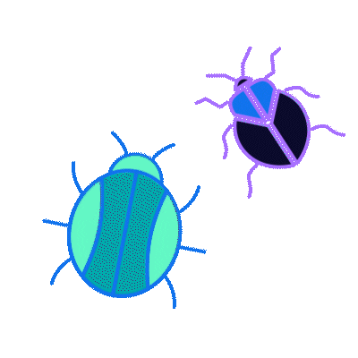

---

A Final-year Computer Science student at <a href="https://www.uitu.edu.pk/">Usman Institute of Technology</a> with a passion for learning and innovating in the tech field. I have a keen interest in exploring new technologies, cyber security, and ethical hacking. I am always excited to contribute to the tech community and expand my skills in cutting-edge areas of technology.

**💬 Ask me about:**

-  Cybersecurity, ethical hacking, computer networking, programming in Scala and Chisel, building processors, and exploring new technologies in the tech world.

## 💻 Tech I work with
                  

---

## 🌐  
📧 Email: kinzaf54@gmail.com

<!-- Crafted with GPRM ( https://gprm.itsvg.in ) -->

### ✍️ Random Dev Quote

